# Sheduled Guider Extension for ComfyUI

This extension contains various nodes for CFG scheduling and other sigma manipulation utilities.

## Guiders Documentation

This section details the advanced CFG Guider nodes provided by this extension.

### Scheduled CFG Guider
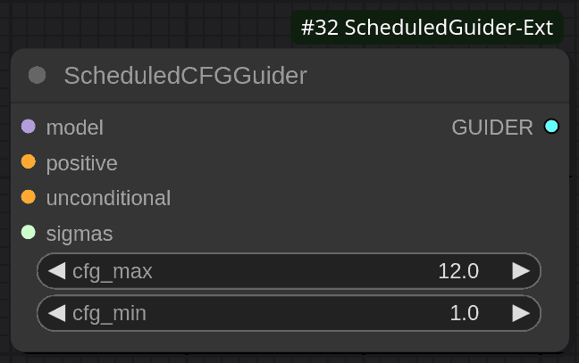

The `ScheduledCFGGuider` node offers a method to dynamically adjust the Classifier Free Guidance (CFG) scale throughout the sampling process. This dynamic adjustment allows for nuanced control over the image generation, potentially starting with stronger guidance and gradually reducing it, or vice-versa, based on the provided sigma schedule.

Thanks to Clybius. I used his [WarmupDecayCFGGuider's source code](https://github.com/Clybius/ComfyUI-Extra-Samplers/blob/52eac1b7c847d2727e0ca93ca26d9ffd77029daa/nodes.py#L675) as a base for the original implementation. The details below describe the current version.

#### Core Purpose

The primary function of the `ScheduledCFGGuider` is to modulate the CFG scale applied during image generation. Instead of a fixed CFG value, this node interpolates between a maximum and a minimum CFG scale. This interpolation is guided by the current sigma value within a predefined schedule of sigmas that the sampler will use. This allows for potentially different levels of creative freedom versus prompt adherence at different stages of the diffusion process.

#### Input Parameters

*   **`model`**: This is the diffusion model that will be guided. The `ScheduledCFGGuider` wraps this model to apply its dynamic CFG logic.
*   **`positive`**: This input accepts the positive conditioning (e.g., text embeddings representing what you want to see in the image). While this is an input parameter to the node itself, it's important to note that during the sampling process, the KSampler (or a similar sampling node) typically provides the actual positive conditioning that will be used. The `positive` input on the node can act as a placeholder or default if not overridden by the sampler.
*   **`unconditional`**: This input accepts the unconditional conditioning (e.g., text embeddings representing what you *don't* want to see, or empty embeddings for standard CFG). Similar to the `positive` input, while the `ScheduledCFGGuider` has this parameter, the KSampler usually supplies the unconditional conditioning used during the actual sampling steps.
*   **`cfg_max`**: This float value defines the maximum CFG scale. This scale is typically applied when the sampling process is at higher sigma values (i.e., earlier in the sampling, when the image is noisier). A higher `cfg_max` encourages stronger adherence to the positive prompt at these initial stages. (Default: 12.0)
*   **`cfg_min`**: This float value defines the minimum CFG scale. This scale is typically applied when the sampling process is at lower sigma values (i.e., later in the sampling, as the image becomes more defined). A lower `cfg_min` can allow for more creative freedom or finer details to emerge as the generation process concludes. (Default: 1.0)
*   **`sigmas`**: This input takes the schedule of sigma values that the sampler is configured to use. The `ScheduledCFGGuider` uses this schedule to determine the current CFG scale. It calculates the current sigma's relative position within the provided `sigmas` list (from the highest sigma to the lowest). Based on this relative position, it interpolates the CFG scale for the current step between `cfg_max` (at the start of the sigma schedule) and `cfg_min` (at the end of the sigma schedule). For example, if the current sigma is halfway through the `sigmas` schedule, the applied CFG scale will be halfway between `cfg_max` and `cfg_min`.

By adjusting `cfg_max`, `cfg_min`, and the sigma schedule, users can precisely control how guidance intensity evolves, potentially leading to improved image quality or specific stylistic effects. The original note about increasing steps in `sigmas` for precision still applies: "Increasing steps in `sigmas` input increase precision on CFG-scheduler curve, while keeping sampling steps count unchanged. You can set like 200 steps in your CFG scheduler. Guider will compute current CFG value depending on your denoising schedule."

### Perpendicular Negative Scheduled CFG Guider (`PerpNegScheduledCFGGuider`)
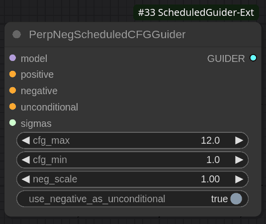

The `PerpNegScheduledCFGGuider` node is an advanced guidance mechanism that extends the functionality of the `ScheduledCFGGuider`. It integrates dynamic CFG scale adjustment with Perpendicular Negative Guidance. This allows users to not only control the intensity of guidance towards a positive prompt over time but also to simultaneously steer the generation process *away* from concepts defined in a negative prompt.

#### Core Purpose

The primary function of this node is to provide fine-grained control over image generation by:

1.  **Dynamically Adjusting CFG Scale:** Like the `ScheduledCFGGuider`, it interpolates the main Classifier Free Guidance (CFG) scale between a `cfg_max` and `cfg_min` value based on the current position in the sampler's `sigmas` schedule.
2.  **Applying Perpendicular Negative Guidance:** It incorporates a negative prompt whose influence is controlled by a `neg_scale`. This technique helps to reduce the common issue where a negative prompt might inadvertently suppress related concepts in the positive prompt. Instead of just "subtracting" the negative prompt, perpendicular guidance aims to remove the negative concepts while preserving the positive ones more effectively.
3.  **Optional Unconditional Baseline Modification:** It offers a flag to use the negative conditioning as the unconditional base for certain internal sampler calculations, which can subtly alter the guidance behavior.

This combination allows for sophisticated control, enabling users to guide the model towards desired attributes while actively discouraging undesired ones, all with a CFG intensity that can vary across the generation process.

#### Input Parameters

*   **`model`**: This is the diffusion model that will be guided. The `PerpNegScheduledCFGGuider` wraps this model to apply its specialized guidance logic.
*   **`positive`**: This input accepts the positive conditioning (e.g., text embeddings for desired attributes). As with other guiders, the KSampler (or a similar sampling node) typically provides the actual positive conditioning used during sampling.
*   **`negative`**: This input accepts the negative conditioning (e.g., text embeddings for concepts to avoid in the image). This is a key component of this node, defining what the generation process should steer away from.
*   **`unconditional`**: This input accepts the unconditional conditioning (often empty embeddings). The KSampler usually supplies this during sampling. Its role can be modified by the `use_negative_as_unconditional` parameter.
*   **`cfg_max`**: This float value defines the maximum CFG scale for the positive prompt. This scale is typically applied at higher sigma values (earlier in the sampling). (Default: 12.0)
*   **`cfg_min`**: This float value defines the minimum CFG scale for the positive prompt. This scale is typically applied at lower sigma values (later in the sampling). (Default: 1.0)
*   **`neg_scale`**: This float value determines the strength of the perpendicular negative guidance. A higher `neg_scale` will make the model try more aggressively to avoid the concepts present in the `negative` conditioning. (Default: 1.0)
*   **`sigmas`**: This input takes the schedule of sigma values that the sampler is configured to use. The guider uses this schedule to interpolate the main CFG scale (between `cfg_max` and `cfg_min`) for the current sampling step.
*   **`use_negative_as_unconditional`**: This is a boolean parameter that alters how the guidance is calculated:
    *   If **`True`**: The `negative` conditioning is also treated as the unconditional base for certain post-CFG (Classifier Free Guidance) calculations within the sampler or specific callback functions. This can be useful if the negative prompt is intended to define a strong baseline from which the positive prompt should diverge, or if the negative prompt is more descriptive than a truly "empty" unconditional prompt. (Default: True)
    *   If **`False`**: The standard `unconditional` conditioning input is used as the baseline for these internal calculations. This is the more traditional approach.

By carefully tuning these parameters, users can achieve a high degree of control over the final image, balancing adherence to the positive prompt, avoidance of negative concepts, and the overall intensity of guidance throughout the generation.

### Understanding the Core Logic: `Guider_ScheduledCFG`

While users interact with nodes like `ScheduledCFGGuider` and `PerpNegScheduledCFGGuider`, the actual guidance logic is encapsulated within an internal Python class named `Guider_ScheduledCFG`. Users do not instantiate or call this class directly; the nodes serve as wrappers that configure and utilize this underlying guider. Understanding its existence and mechanism can be helpful for advanced users or developers extending the system.

#### Core Responsibilities

The primary role of the `Guider_ScheduledCFG` class is to perform the guidance calculations during the sampling process. This is chiefly handled within its `predict_noise` method, which is called by the KSampler (or a similar sampler) at each diffusion step.

#### `predict_noise` Method and CFG Calculation

When the sampler calls `predict_noise(sigma, cond, uncond, cond_scale, image_cond_scale=None, **kwargs)`:

1.  **Sigma Observation**: The method receives the current `sigma` value for the sampling step from the sampler.
2.  **CFG Scale Interpolation**:
    *   The guider has access to the full `sigmas` schedule (an array of sigma values the sampler will iterate through), as well as `cfg_max` and `cfg_min` values. These are provided when the guider object is initialized by its corresponding wrapper node.
    *   It determines the relative position of the current `sigma` within the `sigmas` schedule. For instance, if the current `sigma` is the first (highest) value in the schedule, the position is 0. If it's the last (lowest), the position is 1. If it's somewhere in between, the position is a float between 0 and 1.
    *   Using this relative position, it linearly interpolates the CFG scale for the *current step* between `cfg_max` (at position 0) and `cfg_min` (at position 1).
    *   The `cond_scale` parameter passed into `predict_noise` is *ignored* by this guider, as it calculates its own scale.

3.  **Applying Scheduled CFG**:
    *   The model's noise predictions for the conditional (`cond`) and unconditional (`uncond`) inputs are obtained.
    *   The newly calculated step-specific CFG scale is then used to combine these predictions, typically via the standard CFG formula: `guided_noise = uncond_pred + current_cfg_scale * (cond_pred - uncond_pred)`.

#### Perpendicular Negative Guidance

The `Guider_ScheduledCFG` class is also equipped to handle perpendicular negative guidance if it was initialized with `negative_cond` (negative conditioning) and a `neg_scale` greater than 0. This setup is done by the `PerpNegScheduledCFGGuider` node.

*   If these are present, after the initial scheduled CFG guidance is calculated, the `perp_neg` logic is applied. This involves:
    *   Calculating a guidance adjustment based on the `negative_cond` and `neg_scale`.
    *   Modifying the `guided_noise` to steer it away from the concepts in `negative_cond`, attempting to do so orthogonally to the direction of the `positive_cond` to minimize unwanted suppression of positive concepts.

The final noise prediction, adjusted by both scheduled CFG and potentially perpendicular negative guidance, is then returned to the sampler to continue the diffusion process. The `use_negative_as_unconditional` flag (if set by the `PerpNegScheduledCFGGuider` node) also influences which conditioning is treated as the baseline `uncond` during these calculations.

## Other Sigma Schedulers and Utilities

This extension also provides several utility nodes for creating and manipulating sigma schedules.

## CosineScheduler Node

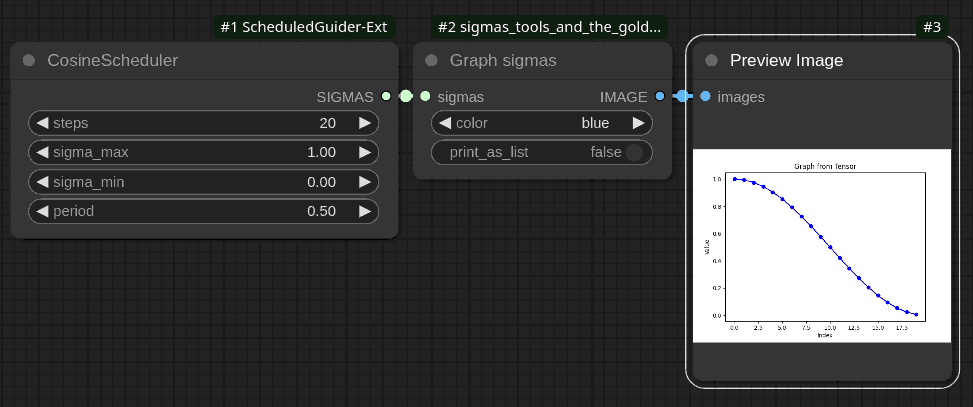

The `CosineScheduler` node generates a schedule of sigma values using a cosine function. This scheduler provides a smooth transition between defined maximum and minimum sigma values over a specified number of steps for specified period of cosine function.

### Parameters

- **steps** (`INT`): Number of discrete steps in the schedule. Determines how many sigma values will be generated.
  - Default: `20`
  - Range: `1` to `10000`

- **sigma_max** (`FLOAT`): The maximum value of sigma in the schedule.
  - Default: `1.0`
  - Range: `0.0` to `5000.0`

- **sigma_min** (`FLOAT`): The minimum value of sigma in the schedule.
  - Default: `0.0`
  - Range: `0.0` to `5000.0`

- **period** (`FLOAT`): Controls the periodicity of the cosine function applied to generate sigma values.
  - Default: `0.5`
  - Range: `0.0` to `5000.0`

### Functionality

- Computes a list of sigma values using a cosine function that transitions smoothly from `sigma_max` to `sigma_min`.
- Utilizes a cosine curve modulated by the specified `period` to adjust the rate and nature of this transition.

## GaussianScheduler Node

The `GaussianScheduler` node generates a schedule of sigma values using a Gaussian (normal) distribution.

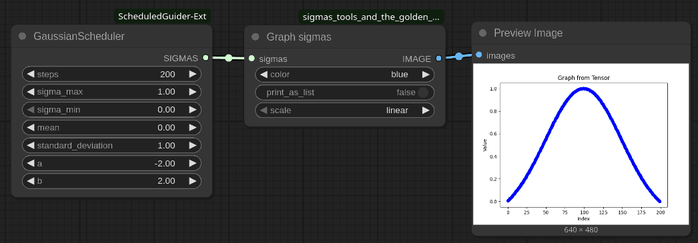

### Parameters

- **steps** (`INT`): Number of discrete steps in the schedule.
  - Default: `20`
  - Range: `1` to `10000`

- **sigma_max** (`FLOAT`): The maximum value of sigma in the schedule.
  - Default: `1.0`
  - Range: `0.0` to `5000.0`

- **sigma_min** (`FLOAT`): The minimum value of sigma in the schedule.
  - Default: `0.0`
  - Range: `0.0` to `5000.0`

- **mean** (`FLOAT`): The mean of the Gaussian distribution used to calculate sigma values.
  - Default: `0.0`
  - Range: `-5000.0` to `5000.0`

- **standard_deviation** (`FLOAT`): The standard deviation of the Gaussian distribution.
  - Default: `1.0`
  - Range: `0.0` to `5000.0`

- **a** (`FLOAT`): The lower bound of the range for generating sigma values.
  - Default: `0.0`
  - Range: `-5000.0` to `5000.0`

- **b** (`FLOAT`): The upper bound of the range for generating sigma values.
  - Default: `1.0`
  - Range: `-5000.0` to `5000.0`
  - Note: If `a > b`, their values are swapped. They must not be equal.

### Functionality

- Computes a list of sigma values based on a Gaussian distribution, smoothly transitioning from `sigma_max` to `sigma_min`.
- Utilizes the Gaussian function defined by the specified `mean` and `standard_deviation`.
- Scales the computed Gaussian values to fit within the range defined by `sigma_min` and `sigma_max`.

## LogNormalScheduler Node

The `LogNormalScheduler` node generates a schedule of sigma values using a log-normal distribution.

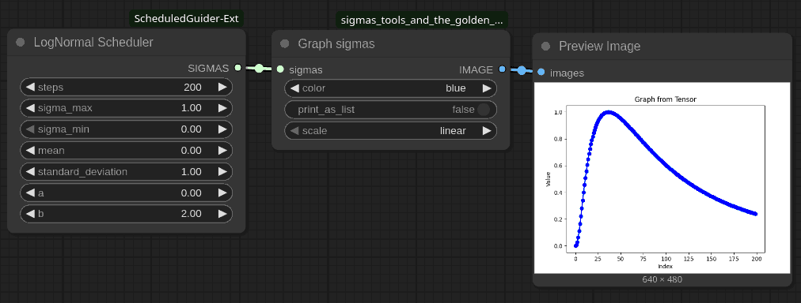

### Parameters

- **steps** (`INT`): Number of discrete steps in the schedule.
  - Default: `20`
  - Range: `1` to `10000`

- **sigma_max** (`FLOAT`): The maximum value of sigma in the schedule.
  - Default: `1.0`
  - Range: `0.0` to `5000.0`

- **sigma_min** (`FLOAT`): The minimum value of sigma in the schedule.
  - Default: `0.0`
  - Range: `0.0` to `5000.0`

- **mean** (`FLOAT`): The mean of the log-normal distribution used to calculate sigma values.
  - Default: `0.0`
  - Range: `-5000.0` to `5000.0`

- **standard_deviation** (`FLOAT`): The standard deviation of the log-normal distribution.
  - Default: `1.0`
  - Range: `0.0` to `5000.0`

- **a** (`FLOAT`): The lower bound of the range for generating sigma values.
  - Default: `0.0`
  - Range: `-5000.0` to `5000.0`

- **b** (`FLOAT`): The upper bound of the range for generating sigma values.
  - Default: `1.0`
  - Range: `-5000.0` to `5000.0`
  - Note: If `a > b`, their values are swapped. They must not be equal.

### Functionality

- Computes a list of sigma values based on a log-normal distribution, smoothly transitioning from `sigma_max` to `sigma_min`.
- Utilizes the log-normal function defined by the specified `mean` and `standard_deviation`.
- Scales the computed log-normal values to fit within the range defined by `sigma_min` and `sigma_max`.

## N/X Scheduler Node Description

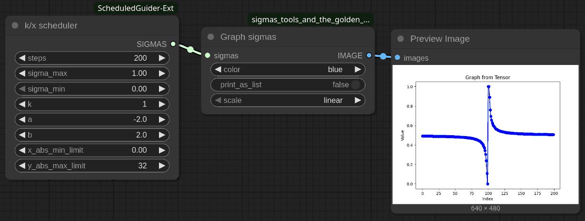

### Overview

The `n/x Scheduler` is a ComfyUI node designed for custom sampling within the CFG-schedulers category. It generates a sequence of sigma values based on an inverse function, allowing for flexible control over the sampling process.

### Inputs

- **steps** (`INT`): The number of steps for which sigma values are generated.
  - Default: 20
  - Range: [1, 10000]

- **sigma_max** (`FLOAT`): The maximum sigma value.
  - Default: 1.0
  - Range: [0.0, 5000.0]

- **sigma_min** (`FLOAT`): The minimum sigma value.
  - Default: 0.0
  - Range: [0.0, 5000.0]

- **k** (`FLOAT`): A constant used in the inverse function calculation.
  - Default: 1.0
  - Range: [0.5, 5000.0]

- **a** (`FLOAT`): The starting point of the range for x-values.
  - Default: 0.0
  - Range: [-5000.0, 5000.0]

- **b** (`FLOAT`): The ending point of the range for x-values.
  - Default: 1.0
  - Range: [-5000.0, 5000.0]

- **x_abs_min_limit** (`FLOAT`): The absolute minimum limit for x-values.
  - Default: 1e-9
  - Range: [1e-256, 2.0]

- **y_abs_max_limit** (`FLOAT`): The absolute maximum limit for y-values (sigma).
  - Default: 0.0
  - Range: [0.0, 5000.0]

### Functionality

The `get_sigmas` function generates sigma values by:

1. Ensuring `a` is less than `b`. If not, they are swapped.
2. Calculating `abs_min_x`, which ensures that `x` does not fall below a certain threshold.
3. Iterating over the specified number of steps to compute sigma values using the formula `k / x`.
4. Scaling the computed sigmas to fit within the range defined by `sigma_min` and `sigma_max`.

## ArctanScheduler Node Description

### Overview

The `ArctanScheduler` is a ComfyUI node designed for custom sampling within the CFG-schedulers category. It generates a sequence of sigma values using an arctangent function.

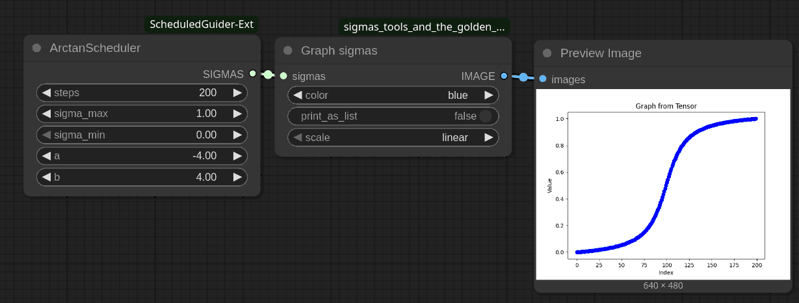

### Inputs

- **steps** (`INT`): The number of steps for which sigma values are generated.
  - Default: 20
  - Range: [1, 10000]

- **sigma_max** (`FLOAT`): The maximum sigma value.
  - Default: 1.0
  - Range: [0.0, 5000.0]

- **sigma_min** (`FLOAT`): The minimum sigma value.
  - Default: 0.0
  - Range: [0.0, 5000.0]

- **a** (`FLOAT`): The starting point of the range for x-values, scaled by π/2.
  - Default: 0.0
  - Range: [-5000.0, 5000.0]

- **b** (`FLOAT`): The ending point of the range for x-values, scaled by π/2.
  - Default: 1.0
  - Range: [-5000.0, 5000.0]

### Functionality

The `get_sigmas` function performs the following operations:

1. Ensures that `a` is less than `b`. If not, their values are swapped.
2. Converts the input range `[a, b]` to radians by multiplying each endpoint by π/2.
3. Iterates through the specified number of steps to compute sigma values using the arctangent function `atan(x)`.
4. Scales the computed sigmas to fit within the range defined by `sigma_min` and `sigma_max`.

## ConcatSigmas Node

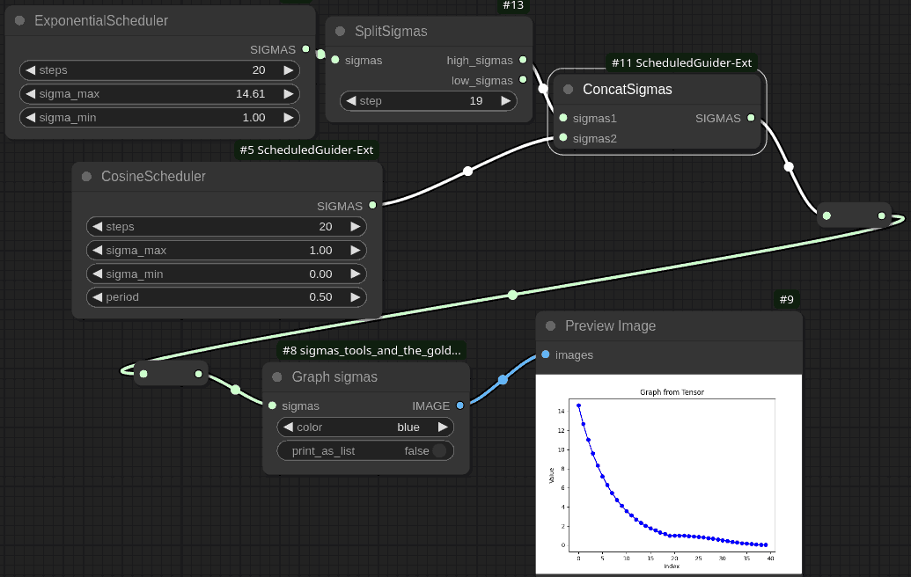

The `ConcatSigmas` node combines two sets of sigma values into a single sequence. This can be particularly useful in diffusion models or any application requiring the merging of different noise schedules.

### Parameters

- **sigmas1** (`SIGMAS`): The first set of sigma values to concatenate.
  
- **sigmas2** (`SIGMAS`): The second set of sigma values to concatenate.

### Functionality

- Takes two input arrays of sigma values (`sigmas1` and `sigmas2`) and concatenates them into a single array.

## InvertSigmas Node

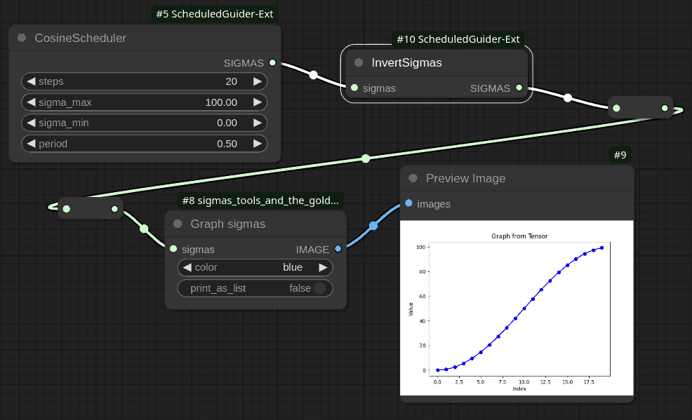

The `InvertSigmas` node inverts the sequence of sigma values such that each value becomes symmetrical around the midpoint between the maximum and minimum sigma values in the original sequence.

### Parameters

- **sigmas** (`SIGMAS`): An array of sigma values to be inverted.

### Functionality

- Calculates the maximum (`sigma_max`) and minimum (`sigma_min`) values within the input sigma values.
- Inverts each sigma value according to the formula:  
  \[
  \text{inverted\_sigma}[i] = \sigma_{\text{max}} - \sigma[i] + \sigma_{\text{min}}
  \]
  This transformation reflects each sigma value about the central point between `sigma_max` and `sigma_min`.

## OffsetSigmas Node

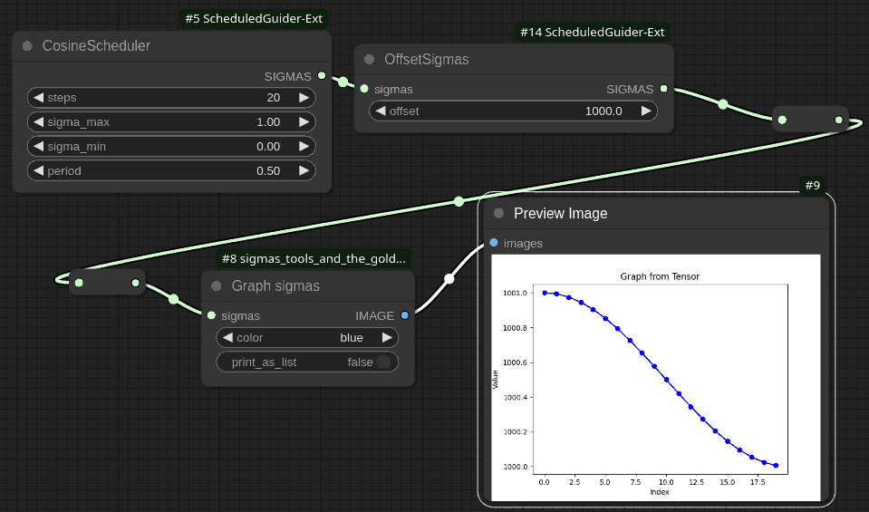

The `OffsetSigmas` node applies an additive offset to each sigma value in a given sequence.

### Parameters

- **sigmas** (`SIGMAS`): An array of sigma values that will be adjusted by the specified offset.
  
- **offset** (`FLOAT`): The amount by which each sigma value will be incremented.
  - Default: `1.0`
  - Step: `0.1`

### Functionality

- Iterates through each sigma value in the input array and adds the specified `offset`.

## SplitSigmasByValue Node

The `SplitSigmasByValue` node divides an array of sigma values into two separate arrays based on a specified threshold value. This can be useful in diffusion models or other processes where you need to handle different ranges of noise levels separately.

### Parameters

- **sigmas** (`SIGMAS`): An array of sigma values that will be split into two groups.
  
- **value** (`FLOAT`): The threshold value used to determine the split point.
  - Default: `1.0`
  - Minimum: `0.0`
  - Maximum: a very large number —`2^60`

### Functionality

- Iterates through the array of sigma values.
- Splits the sigma values into two arrays:
  - `high_sigmas`: Contains all sigma values greater than the specified `value`.
  - `low_sigmas`: Contains all sigma values less than or equal to the specified `value`.
- Returns two arrays, `high_sigmas` and `low_sigmas`, representing the split groups.

### Usage

This node is particularly useful when you need to apply different processing steps to high and low noise levels in a schedule. For example, in a diffusion model, you might want to treat steps with higher noise differently from those with lower noise.

## PredefinedLogarithm Node Description

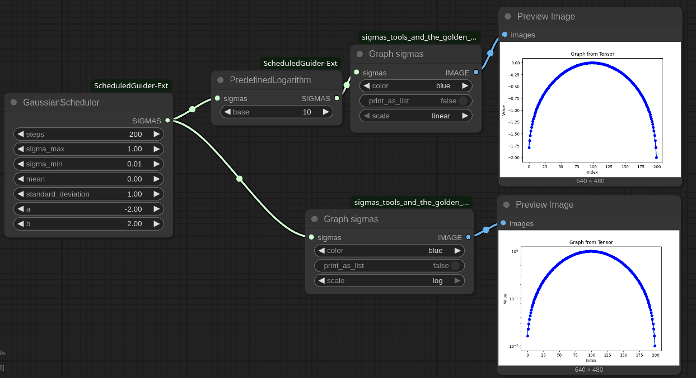

### Overview

The `PredefinedLogarithm` node is part of the custom sampling category in ComfyUI. It allows to apply a logarithmic transformation to a sequence of sigma values using predefined bases: natural logarithm (`e`), base 10, or base 2.

### Inputs

- **sigmas** (`SIGMAS`): The input sigma values that need to be transformed.
  
- **base** (`ENUM`): The logarithm base to be used for transformation.
  - Options: `"e"`, `"10"`, `"2"`
  - Default: `"e"`

### Functionality

- Applies the specified logarithmic transformation to each sigma value.
- Supports three predefined bases:
  - Natural logarithm (`e`)
  - Base 10 logarithm
  - Base 2 logarithm

---

## CustomBaseLogarithm Node Description

### Overview

The `CustomBaseLogarithm` node also belongs to the custom sampling category in ComfyUI. It allows to specify any positive real number as the base for the logarithmic transformation of sigma values.

### Inputs

- **sigmas** (`SIGMAS`): The input sigma values that need to be transformed.

- **base** (`FLOAT`): The base of the logarithm to be applied.
  - Default: 2.0
  - Range: [1.1, ∞)

### Functionality

- Transforms each sigma value using a logarithm with a user-defined base.
- Allows for highly customizable transformations based on specific requirements.

## PredefinedExponent Node Description

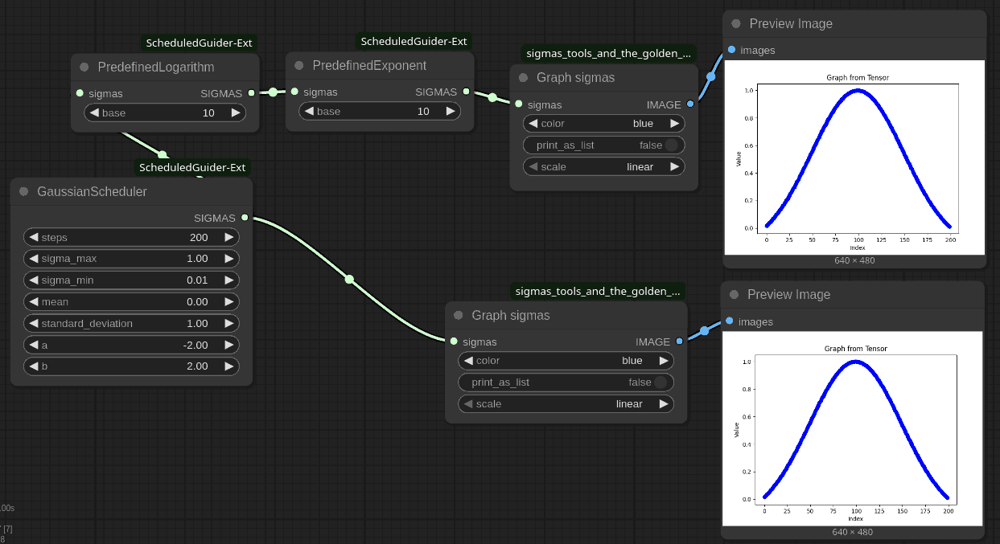

### Overview

The `PredefinedExponent` node is part of the custom sampling category in ComfyUI. It allows to apply an exponential transformation to a sequence of sigma values using predefined bases: natural exponent (`e`), base 10, or base 2.

### Inputs

- **sigmas** (`SIGMAS`): The input sigma values that need to be transformed.
  
- **base** (`ENUM`): The base for the exponential transformation.
  - Options: `"e"`, `"10"`, `"2"`
  - Default: `"e"`

### Functionality

- Applies the specified exponential transformation to each sigma value.
- Supports three predefined bases:
  - Natural exponent (`e`)
  - Base 10
  - Base 2

## Usage

This node is ideal for reverting logarithmic transformations applied to sigma schedules, enabling users to scale their sigma values exponentially. It's particularly useful when users want to revert previously applied logarithmic scales back to their original form.

---

## CustomExponent Node Description

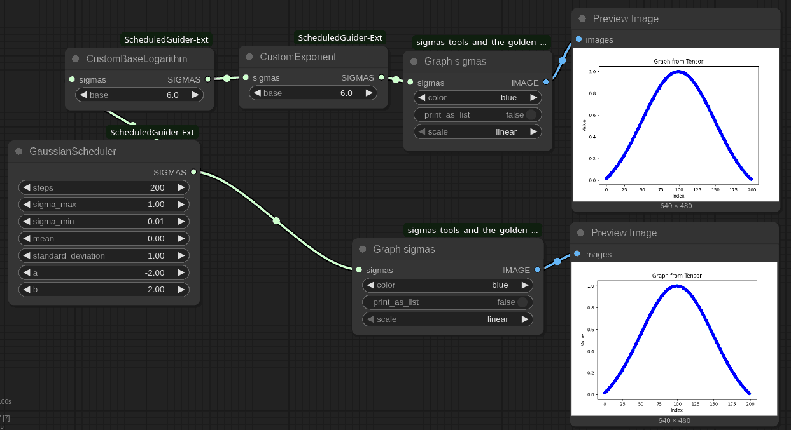

### Overview

The `CustomExponent` node also belongs to the custom sampling category in ComfyUI. It allows to specify any positive real number as the base for the exponential transformation of sigma values.

### Inputs

- **sigmas** (`SIGMAS`): The input sigma values that need to be transformed.

- **base** (`FLOAT`): The base of the exponential function to be applied.
  - Default: 2.0
  - Range: [1.1, ∞)

### Functionality

- Transforms each sigma value using an exponential function with a user-defined base.
- Allows for highly customizable transformations based on specific requirements.

---

## SigmasToPower Node Description

### Overview

The `SigmasToPower` node is part of the custom sampling category in ComfyUI. It allows to raise each sigma value to a specified power, providing a straightforward way to adjust the distribution of sigma values.

## Inputs

- **sigmas** (`SIGMAS`): The input sigma values that need to be transformed.

- **power** (`FLOAT`): The exponent to which each sigma value will be raised.
  - Default: 2.0
  - Step: 0.1

## Functionality

- Raises each sigma value to the specified power.
