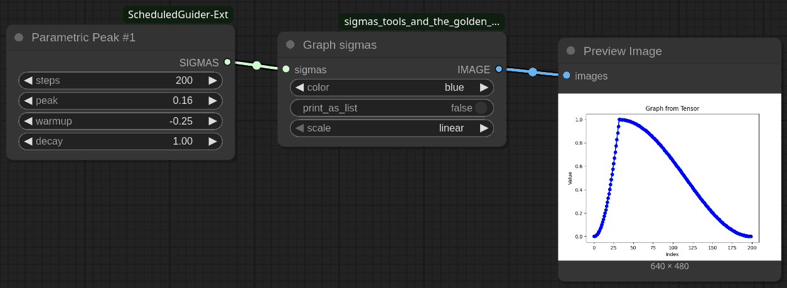

# ParametricPeakNo1

The **ParametricPeakNo1** node generates a customizable CFG schedule with a single peak, allowing fine control over the guidance in diffusion models. The curve's shape can be adjusted using the `peak`, `warmup`, and `decay` parameters.

## Parameters

- **steps** (`INT`):  
  The total number of sampling steps.  
  *Default: 200, Range: 1–10000*

- **peak** (`FLOAT`):  
  The relative position of the peak in the sigma curve (from 0.0 to 1.0, as a fraction of total steps).  
  *Default: 0.25, Range: 0.11–0.91*

- **warmup** (`FLOAT`):  
  Controls the shape of the curve before the peak.  
  - Positive values create a convex ramp-up.
    - Values above 1.0 creates padding, an empty space with zeros.
  - Negative values create a concave ramp-up.
  - Zero produces a linear ramp.  
  *Default: 1.0, Range: -0.99–1.95*

- **decay** (`FLOAT`):  
  Controls the shape of the curve after the peak.  
  - Positive values create a convex decay.
    - Values above 1.0 creates padding, an empty space with zeros.
  - Negative values create a concave decay.
  - Zero produces a linear decay.  
  *Default: 1.0, Range: -0.99–1.95*

## Usage

This node is useful for creating custom CFG schedules where the CFG rises to a peak and then falls, with flexible control over the ascent and descent shapes.

